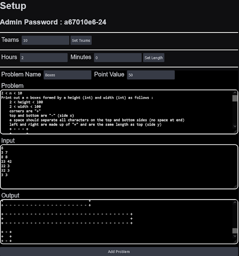
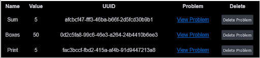
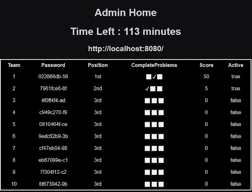
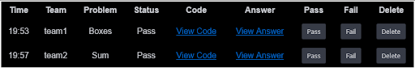
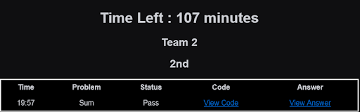
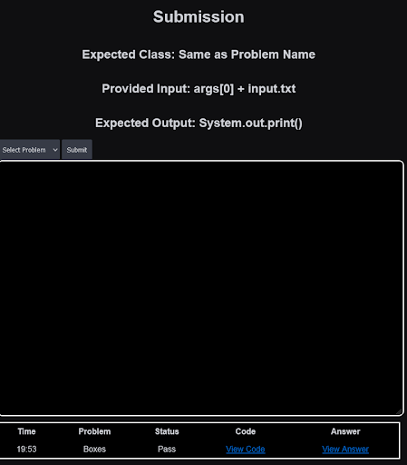

# Apache Tomcat Server For Java Competitions
*This repo was created as a storage/backup, code will likely not run on your machine

## Summary 
The project is an Apache Tomcat server that hosts a java coding competition. 
It uses a SQLite database to maintain state and manages a unique session for all users. 
Once code is submitted it is dynamically compiled and ran and the standard output is 
recorded and checked for accuracy. All access is through the website including setup 
and administration.

## Examples of Project Running

### Competition Setup

### Setup Problem List

### Admin Interfaces (after competition starts)

### User Interfaces

